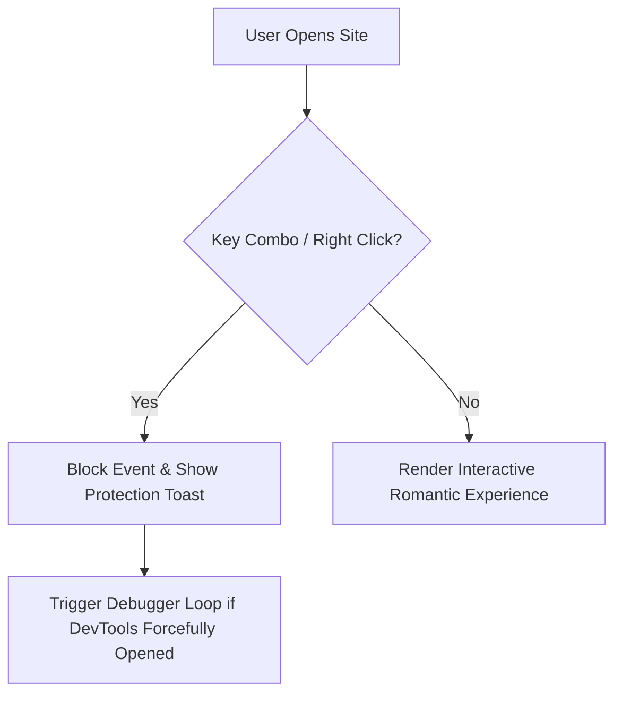

<div align="center">

  # 💍 A Romantic Proposal Site ✨
  ### *An Enchanting, High-Luxury Interactive Proposal Experience for Sarah & Ahmad*

  [](https://nextjs.org/)
  [](https://www.typescriptlang.org/)
  [](https://tailwindcss.com/)
  [](https://www.framer.com/motion/)
  [](LICENSE)

  <br />

  <p align="center">
    <b>A personalized digital love story featuring a 350+ diamond starfield, interactive sealed envelope letter, evasive proposal physics, multi-song playlist engine, and grand multi-stage fireworks celebration.</b>
  </p>

  ---

</div>

<br />

## 🌟 Key Highlights & Features

| Feature | Description |
| :--- | :--- |
| **🌌 Sparkling Diamond Starfield** | 350+ multi-colored sparkling stars (Diamond White, Warm Gold, Rose Pink, Champagne) with 4-point cross flares and soft radial glow. |
| **💌 Secret Sealed Love Letter** | Authentic wax-sealed envelope opening with custom **Lucy Said Ok Personal Use** / **Hugh is Life Personal Use** handwritten font integration. |
| **🎵 Smart Romantic Playlist** | Multi-track audio player automatically launching **Pehli Dafa (Karaoke)** on site open, and dynamically switching to **Pehli Dafa (Original)** upon opening the secret letter. |
| **💍 Evasive Proposal Physics** | Interactive "Do You Love Me?" question with evasive NO button physics, playful Roman Urdu pleading tooltips, and dynamic YES button growth. |
| **🎉 Grand Fireworks Finale** | Multi-stage canvas confetti and fireworks explosion triggering celebration modal with custom high-contrast love bears. |
| **📸 3D Memory Photo Slider** | Smooth 3D picture carousel with auto-slide, hover-pause, dot navigation, and romantic Urdu captions. |
| **🔒 Source Security Shield** | Built-in inspection lock disabling `F12`, `Ctrl+Shift+I`, right-click context menu, and debugger traps. |

<br />

---

## 🎨 Typography & Local Font Architecture

The application is engineered with custom handwritten font stacks:

- **Secret Love Letter Font**: Configured with local `@font-face` for **Lucy Said Ok Personal Use** (`Lucy Said Ok Personal Use.ttf`) in unbolded (`font-normal`) presentation for delicate handwriting curves.
- **Universal Custom Font Support**: Configured for **Hugh is Life Personal Use** (`Hugh is Life Personal Use.ttf` / `.otf`) across sections while preserving the top hero recipient badge (`Great Vibes`).

```css
@font-face {
  font-family: 'Lucy Said Ok';
  src: url('./Lucy Said Ok Personal Use.ttf') format('truetype');
  font-weight: normal;
  font-style: normal;
}
```

<br />

---

## 🎵 Playlist Engine & Audio Triggering

The background audio system (`#bgAudio`) automatically manages 5 romantic tracks:

1. **Track 1 (Default Opening)**: `Pehli Dafa (Karaoke Version)` by Atif Aslam *(Plays automatically on site opening)*
2. **Track 2 (Secret Letter Trigger)**: `Pehli Dafa (Original)` by Atif Aslam *(Triggers upon tapping the envelope seal)*
3. **Track 3**: `Jeene Laga Hoon` by Atif Aslam & Shreya Ghoshal
4. **Track 4**: `Aarzu` by Asim Azhar & Noor
5. **Track 5**: `Aaj Se Teri` by Arijit Singh

<br />

---

## 🔒 Source Code Security & Inspect-Locking

To preserve the magic and protect the source code during presentation and deployment:



- **Context Menu Lock**: `contextmenu` right-click disabled.
- **Shortcuts Captured**: `F12`, `Ctrl+Shift+I`, `Ctrl+Shift+J`, `Ctrl+Shift+C`, `Ctrl+U`, `Ctrl+S`.
- **Source Maps Disabled**: Production JavaScript obfuscated without unminified TypeScript source maps.

<br />

---

## 🛠️ Technology Stack

- **Core**: HTML5, Next.js 15, React 19, TypeScript
- **Styling**: Tailwind CSS, Vanilla Glassmorphism CSS3
- **Animations**: Framer Motion, HTML5 Canvas API, Canvas Confetti
- **Icons**: Lucide React
- **Hosting**: Vercel / Netlify / Static HTML

<br />

---

## 🚀 Quick Start & Deployment

### Run Locally (Static HTML)
Simply open `index.html` in any modern web browser:
```bash
# Clone the repository
git clone https://github.com/your-username/a-romantic-proposal-site.git

# Open index.html directly
start index.html
```

### Run Locally (Next.js Application)
```bash
# Install dependencies
npm install

# Start development server
npm run dev
```
Navigate to `http://localhost:3000`.

### Deploy to Vercel (1-Click)
1. Push repository to GitHub.
2. Import project into [Vercel](https://vercel.com).
3. Click **Deploy**!

<br />

---

<div align="center">

  Made with ❤️ by **Ahmad** for **Sarah**

  *“Every moment led us here... Forever begins right now.”* 💍✨

</div>
